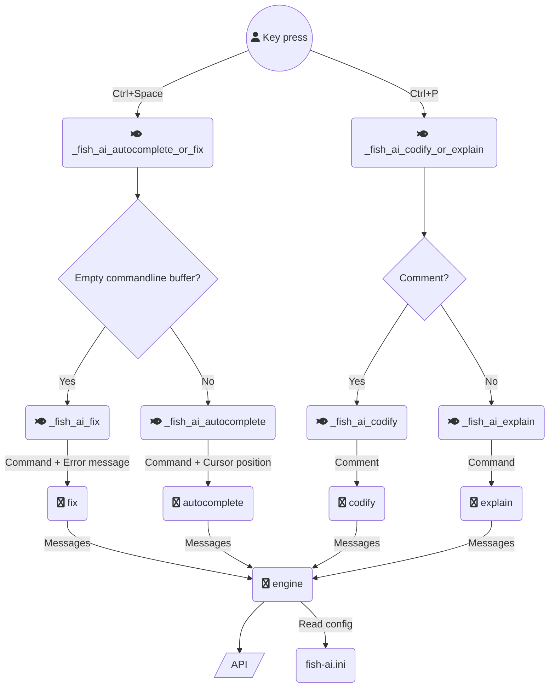

# Architecture

This document describes the architecture of the `fish-ai` plugin.

The primary audience is any developer who wants to contribute to the
project.

## Overview

Even though this is a plugin for fish, most of the business logic
lives in a Python module. Many AI vendors provide Python packages
for interacting with their services and I wanted to dive deeper
into the Python ecosystem, so it felt like a natural fit.

This is a list of the most important files and directories in the
repository:

- `conf.d/fish_ai.fish`: Registers the key bindings and contains hooks
invoked by the fisher package manager.
- `functions/_fish_ai_autocomplete_or_fix.fish`: Entrypoint when pressing
`Ctrl + Space`.
- `functions/_fish_ai_codify_or_explain.fish`: Entrypoint when pressing
`Ctrl + P`.
- `src/fish_ai`: Directory containing the `fish_ai` Python module with most
of the business logic.

## How the plugin is installed

The plugin is intended to be installed using the fisher package manager.
As explained [here](https://github.com/jorgebucaran/fisher/blob/main/README.md#creating-a-plugin), when a user runs `fisher install`, fisher will copy
the `functions` and `conf.d` directories to the user's home directory and
invoke the `_fish_ai_install` hook in `conf.d/fish_ai.fish`.

The install hook will then create a virtual environment using `venv` and run
`pip` to install the `fish_ai` module directly from the git repository here
on GitHub.

The virtual environment is created in the `~/.fish-ai` directory. It will
contain the `fish_ai` module along with its dependencies.

The configuration file `~/.config/fish-ai.ini` is the only file that lives
outside this virtual environment, so the user can remove the plugin without
their configuration disappearing.

## How the Python module is structured

The Python module is located in the `src/fish_ai` directory. It contains
the backend code for constructing the prompt, reading configuration values
and making API calls. It also bundles `fzf`for showing autocompletions.

Here are the most important files and directories:

- `src/fish_ai/tests`: Contains the unit tests which can be executed
using `pytest`.
- `src/fish_ai/engine.py`: Contains the core logic of the plugin, such as
constructing the system prompt and making API calls.
- `src/fish_ai/autocomplete.py`: Constructs the prompt for creating
completions and displays the fuzzy finder window.
- `src/fish_ai/fix.py`: Constructs the prompt for fixing the commandline.
- `src/fish_ai/codify.py`: Constructs the prompt for codifying the commandline.
- `src/fish_ai/explain.py`: Constructs the prompt for explaining the current
commandline.
- `src/fish_ai/redact.py`: Contains the logic for redacting sensitive information
from the prompt.
- `src/fish_ai/config.py`: Contains logic for parsing the contents of `fish-ai.ini`.

## How the key bindings work

The key bindings are registered using `bind` when the shell starts. When
pressing `Ctrl + Space` or `Ctrl + P`, the corresponding function in
the `functions` directory is called. This function will grab the contents
of the commandline buffer and pass it to the `fish_ai` module which is
doing the actual API call.

Here is what it looks like:

